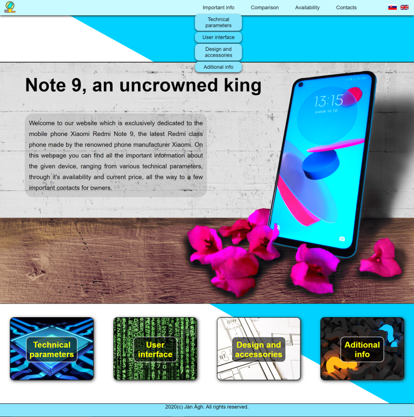

## Project overview

Static website about the Xiaomi Redmi Note 9 phone, availabne in both Slovak and English.

The website utilizes responsive design optimized for desktops, tablets as well as mobile phones.

### Used technologies

- HTML5
- CSS3
- JavaScript
- PHP
- Adobe Photoshop (photo editing)
- Inkscape (creation of graphics)

### Website structure

- Main Page
- Technical Parameters Page
- User Interface Page
- Design & Accessories Page
- Aditional Information Page
- Comparison Page
- Availability Page
- Contacts page

### Design overview

Below can be seen the design, layout and content of the main page. The designs of the other pages are derived from it.

All images, videos, logos and sounds are copyrighted as they were created and edited by me.

Basic information about the entire creation process can be found in the attached pdf file.

2020 &copy; Ján Ágh